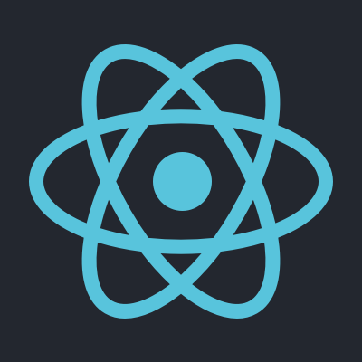
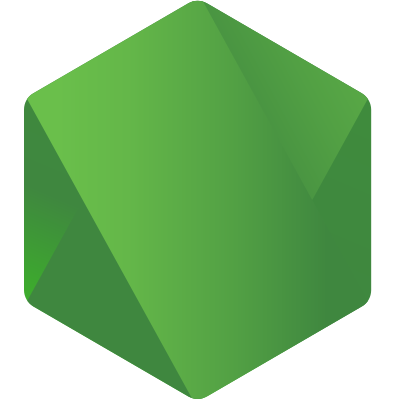
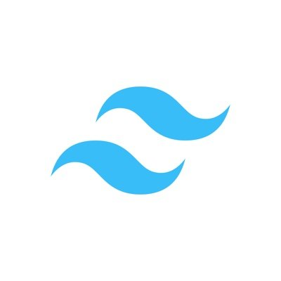
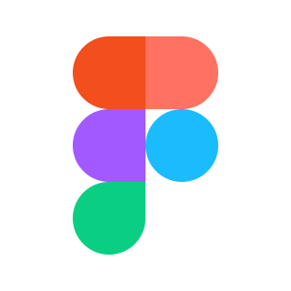
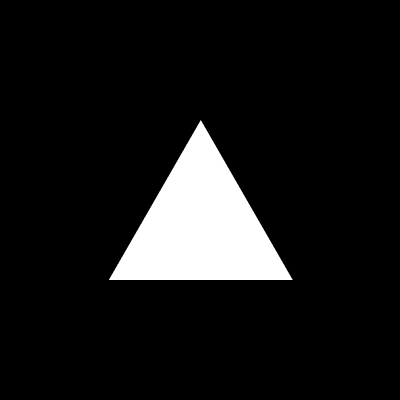

  

## Hello, I am Souradeep Pradhan

  &nbsp;
  &nbsp;
  &nbsp;
  &nbsp;
  &nbsp;
  

I'm a full-stack developer who enjoys turning complex problems into simple, elegant solutions. I focus on building scalable, performant web applications with clean architecture, thoughtful design, and real-world impact. From idea to production, I care about writing code that's maintainable, meaningful, and built to last.

### My Contribution

  <picture>
    <source media="(prefers-color-scheme: dark)" srcset="https://github.com/pradhan-not-found/pradhan-not-found/raw/output/github-contribution-grid-snake-dark.svg">
    <source media="(prefers-color-scheme: light)" srcset="https://github.com/pradhan-not-found/pradhan-not-found/raw/output/github-contribution-grid-snake.svg">
    
  </picture>

### Skills

  
  
  
  
  
  
  
  
  
  
  
  
  
  
  
  
  

### GitHub Stats

<table border="0" cellspacing="8" cellpadding="0">
<tr>
<td>
  
</td>
<td>
  
</td>
</tr>
<tr>
<td>
  
</td>
<td>
  
</td>
</tr>
</table>

### Let's Connect

&nbsp;
&nbsp;
&nbsp;

